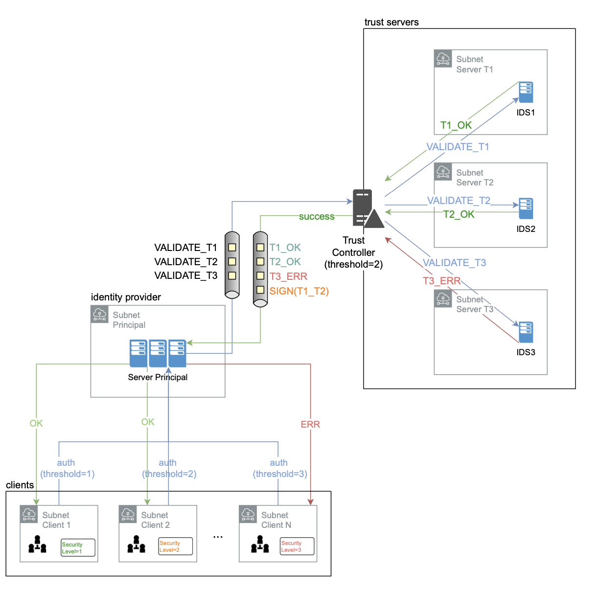
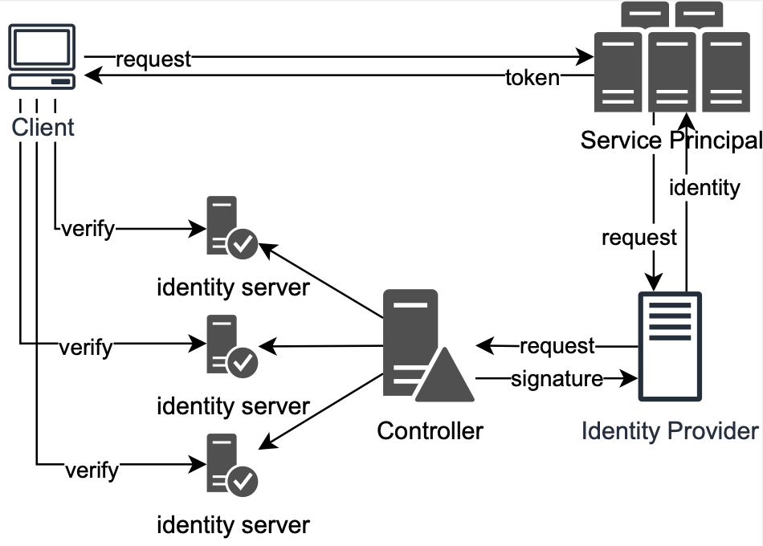
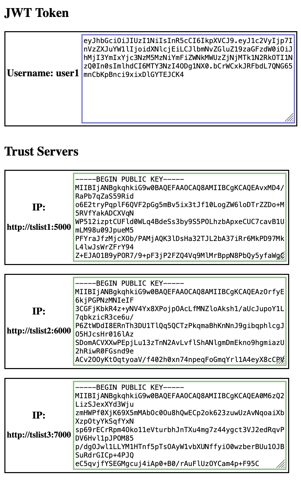
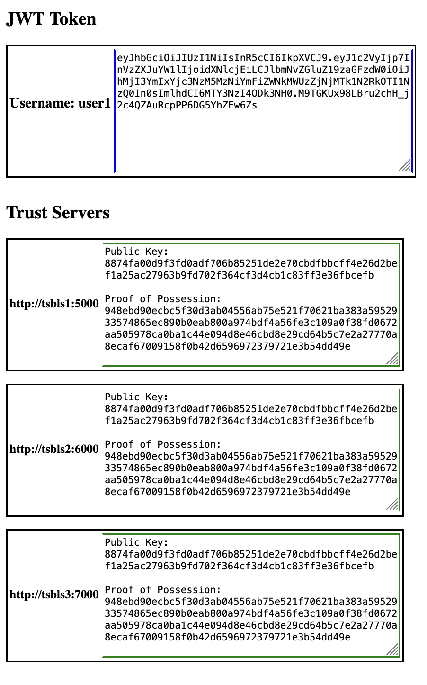
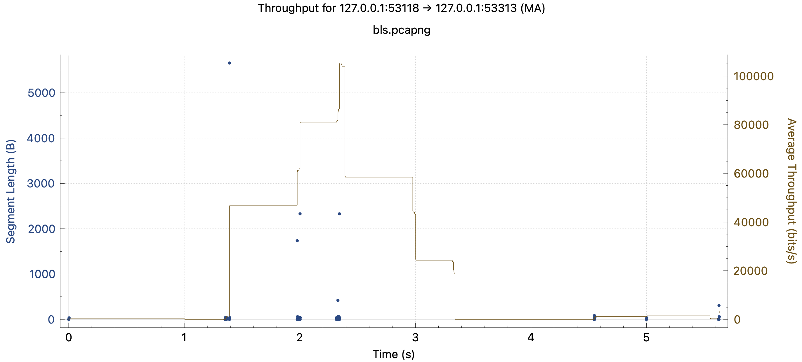
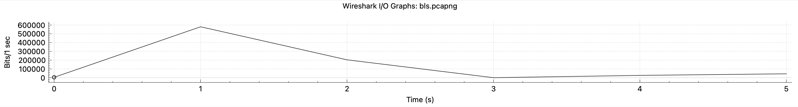
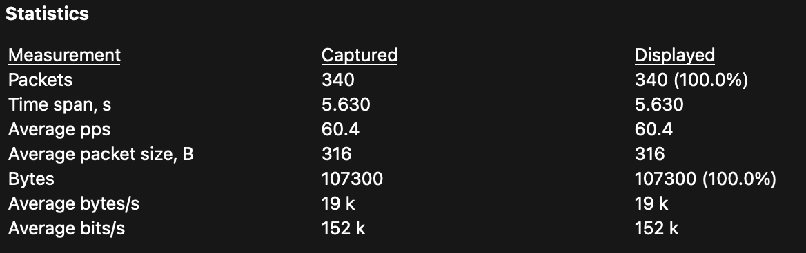
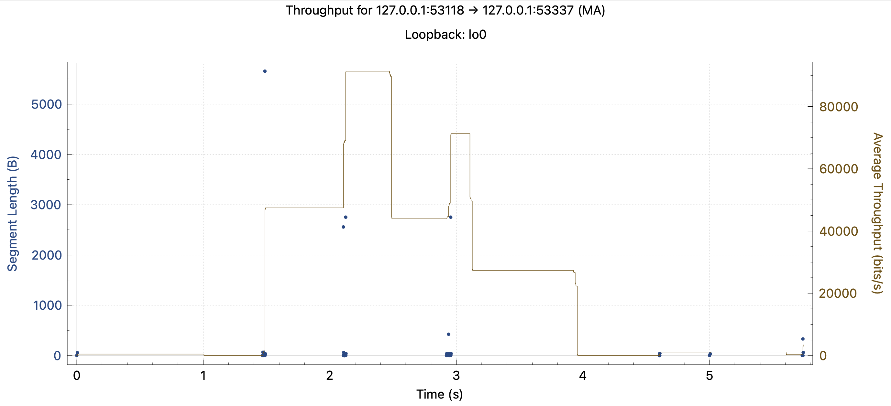
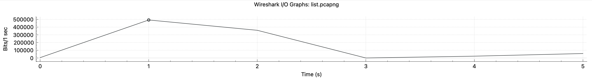
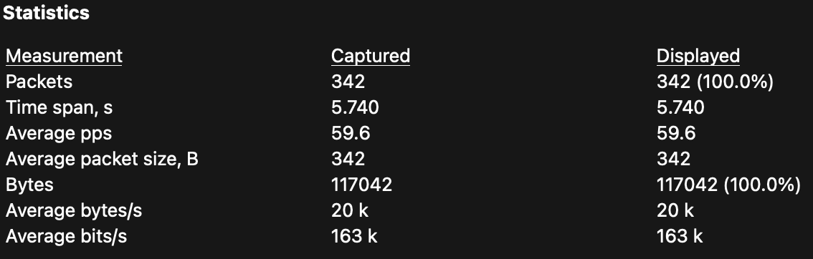

# Advanced Face Authentication System: Ensuring Security and Robustness

  

# Introduction

In passwordless authentication systems, the user no longer needs to remember and use the login credentials. The password in this case would be nonexistent and therefore impossible to steal. The end user benefits from this simplicity, being able to use this system as a Single-Sign-On or as a secure method of logging in to a service. Despite using a nontraditional login system, at the application level there will be complete transparency with respect to the authentication system used. There are various modes of passwordless authentication, such as authentication through QR-Code (i.e. scanning a QR code), Magic Links (accessing static pre-made links) or through Biometrics. This project will study passwordless access via facial biometrics, although it is possible to extend the project to any type of biometrics.

---

Passwordless authentication has many benefits, but it also has many critical points to be analyzed and on which we must pay attention. Implementation of such an approach must be done following a cost-benefit analysis. In particular, with facial authentication, the access system must maintain stringent constraints to ensure the minimum level of security. 

- **Accuracy**: Access to the system with a user's identity must not be possible, so there must be a high degree of reliability of access. 
- **Security**: Facial recognition systems can be bypassed by an attacker using false images or videos, so it is important to use a system with low recognition confidence or a system that is not capable of performing three-dimensional scans.

In the case of an implementation using three-dimensional biometrics, the cost of the system and feasibility decreases, as each user should have adequate hardware to perform the scan. The most important details in this text are the security issues associated with facial unlocking, the accessibility of the application, and the use of a webcam for authentication. Privacy is important, as it should not be possible to reproduce or reconstruct a face from the known string. Accessibility is also important, as the end user must make use of a webcam to use the application properly. Special hardware components are used to project a matrix of lights onto the user's face, which can then be analyzed by a special camera to produce a fingerprint of the user. Using only the webcam, on the other hand, ensures greater availability of the service at the expense of security.

---

# Architecture

  

- Client: Provides for client access to the service, starting with the individual user and ending with the organization that chooses to adopt the passwordless methodology. Here, clients connect to the service according to the level of security they wish to maintain. A client that needs numerous servers to sign its face will choose a higher level of security. To access less critical services, it will also be possible for the client to choose a lower level of security, which will benefit from faster signing and less bandwidth occupancy. The client connects through the browser to the Service Provider's address, enters its Username and takes the picture. After a few milliseconds he receives a response from the server: if the photo is valid and the encoding matches the one saved on the Identity Provider, the user accesses the Service Homepage, otherwise he will receive HTTP error 401 (Unauthorized).
- Server: This part is responsible for receiving the user's request, generating the face encoding and sending it to a controller that will handle the signature request by forwarding the encoding to the trust servers. This is where we deliver the service to the user and generate the token that will then be used within the service and uniquely identify the user on the Web site. The first step the Service Provider takes is to receive the request from the Clients and process the face encoding locally. After the processing is finished it turns the request made to the Identity Provider who prepares the request for the Trust Controller, if the user is registered in the system and waits for response. The Trust controller in turn, knowing the list of signing servers, has the logic to make a request to each server and merge the signatures.
- Signature: At this level, the signature servers come in and compare the encoding of the previously sent face with the one saved by the users' identity manager. Trust Servers do an array comparison operation that will return a positive result only if the generated encoding falls within a confidence interval specified at runtime. In other words, if the encoding is similar enough to the saved encoding, they will sign the packet and return it to the client. Trust Servers, depending on the type of signature the system will have, will differ greatly. In fact, the service can use two different systems to sign and generate the tokens: one is based on the RSA algorithm and one uses BLS signatures, better described later. Deployment is done parametrically, using the same container but changing the environment variables for each new server. The Trust Controller needs to be aware of all the servers signing the picture, to better manage the security of the system.

# Signature 

In the diagram in the figure we can see how the first step in requesting an identity from the client to the server or Service Provider. Here the Service Provider is then contacted by specifying the user's username. It is in the Service Provider that the deployment of the client reachable webserver is done and it is he who is in charge of processing the client face to generate the encoding.
Once the encoding generation is complete, an identity request is sent to the Identity Provider that contains the previously generated encoding and the user's username as parameters. If the username matches an existing one, the request formed by the encoding just received and the encoding saved for that user, concatenated with the username, is forwarded. This packet is sent to the Trust Controller.
The Controller retrieves the server number configured at runtime, according to the required security level, and prepares a cyclic request for each Identity Server or Trust Server present, which includes the two received encodings and the user's username. Each server is responsible for producing a boolean indicating whether the two arrays are similar. If the result is positive, each server produces a piece of the token which is then sent to the Trust Controller as a response. If one of the servers is unreachable it is skipped.
The generated response, which includes all the pieces of the tokens created, is then sent back to the Identity Provider who provides the identity and the JSON Web Token to the client who will be identified on the Web site until he logs out. Finally, the application can use two different signature modes: the List mode and the mode with BLS. Regardless of the signature type, the operation of the service will appear transparent to the user, who will always be validated and identified via a JWT.

## Type of Signature: RSA vs BLS

  
  

### RSA Mode
In this mode, each Trust Server signs the response with its public key and sends the packet to the Trust Controller, which will collect the signatures and send them to the Service Provider via the Identity Provider. At this point the Server may encrypt a session key with the public key retrieved from the Trust servers' signatures and send it to the various Trust Servers. If each of them responds with the correct decryption of the session key, through its own private key, then that server is registered as valid and the number of servers that have signed the session token is increased by one. When the number of signatures is greater than the desired security limit for the specific Service Provider, the session token is considered valid and the user is free to browse the Web site until he logs out, where the signatures are invalidated.
Considering the implementation side, an asymmetric encryption mode is used for this type of signature, using an RSA library on Python.

### BLS Mode
This signature mode, implements a multi-signature widely used in the Blockchain to reduce the size of transactions, where to verify a set of signatures, the verificator must have an *aggregate()* function of the signatures, it must maintain only a reduced aggregation of all the signers' public keys. Doing so reduces the number of computed elements which then results in faster signature verification by having less computational effort.
In the case of Trust Servers, each server generates its own token through the bls signature() function, encrypting the encoding and username. This information will be concatenated to the Proof of Possession of the private key and sent to the Trust Controller. Here the aggregate() is created, which will merge all server signatures and send them to the Service Provider through the Identity Provider. When receiving the packets to be validated, the Server Principal will verify the signature with *verify_aggregate()* which compares the set of generated signatures with the Proof of Possession list of public keys retrieved from each Trust Server.

## Performances

In this section we distinguish the different type of signature from the performance point of view. Wireshark was used to produce the graphs. The tests performed consider a single login via facial registration (and then sending the photo, generating the encoding and signing servers) followed by the user's logout.
To analyze network traffic with Wireshark, we can hook a probe to the loopback interfaces of the system. This is possible because it is used Minikube, which is a method of running Kubernetes locally, on localhost interfaces and enabling port forwarding to reach the Service Provider service on port 1111 with the browser. This way the webserver can be reached and communications between the internal servers can be intercepted. Thanks to the statistics section of Wireshark it is then possible to create meaningful graphs for bandwidth usage, packet size, and on the TCP statistics of the connection.
We can see the first graph representing the total number of packets computed and then forwarded between servers to accomplish a signature, with an analysis on the average bandwidth consumed. The second and third show the total network throughput and the percentage of outgoing and incoming packets in the servers, over the 5 seconds of usage. In the figures we see that in 2 seconds there is a peak in network utilization: this is due to the sending, processing of the picture and the request and then subsequent sending of the signatures by the trust servers. The graph continues with a smaller peak indicating user logout. The I/O graphs represent the same situation, but include both server input and output data.
During the system usage, a user performing the same login and and logout action, has different bandwidth usage. This is because the two signature modes employ different resources, both in terms of network usage and computing resources. In list mode we note that for the same actions there are **342** packets used, compared to **340** in BLS mode. On the other hand, analyzing the bitrate of both, the **163** Kbit/s of the list mode stands out, against the **152** Kbit/s of the BLS mode: a reasonable result given that the Average packet size of a BLS packet is **316** Bytes, against the **342** of the list mode. We thus note that BLS has about **0.6**% fewer packets used, about a **6.7**% less Kbit/s exchanged during signing, and a **7.6**% smaller Average packet size than the list mode.

<h3>BLS</h3>
  
  
  
<h3>RSA</h3>
  
  
   

